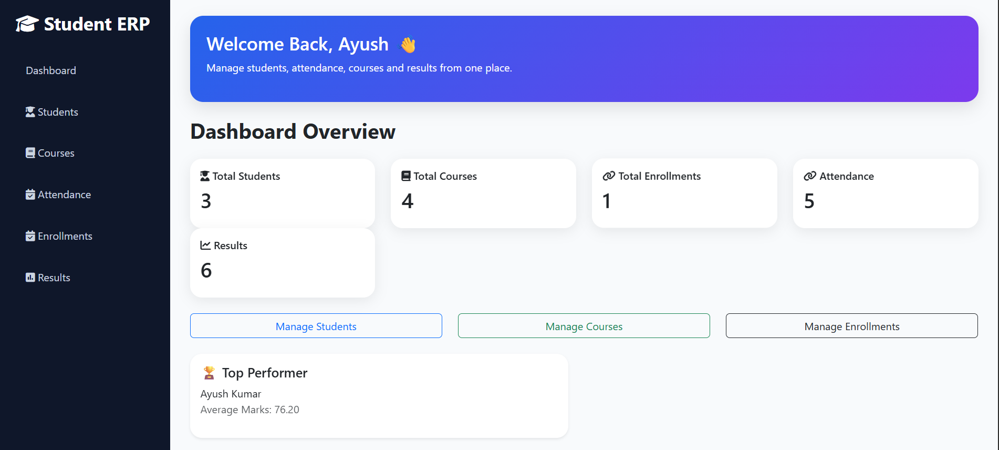
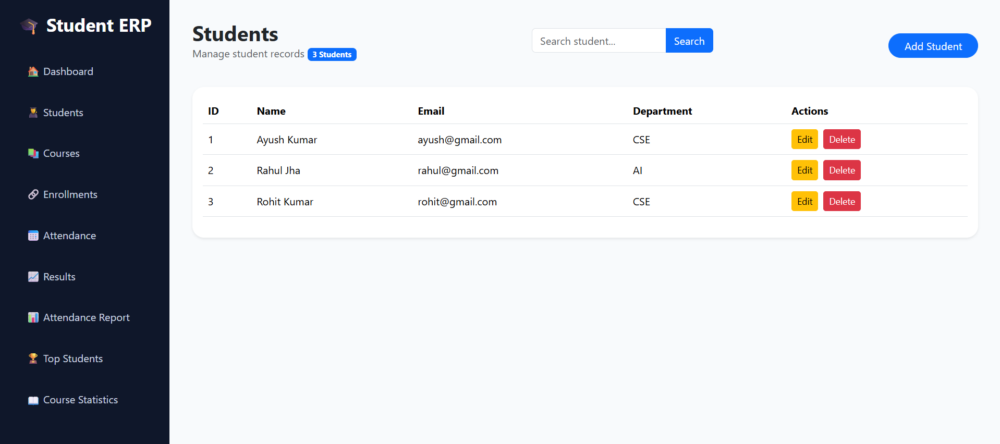
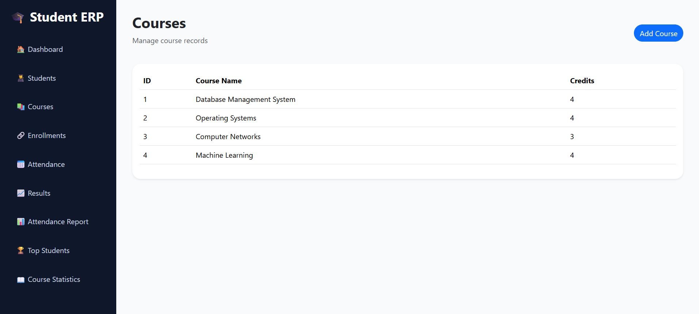
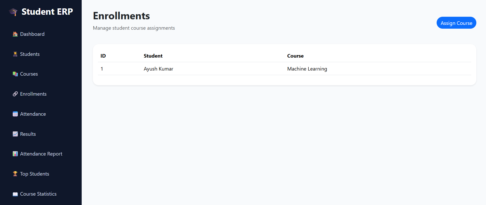
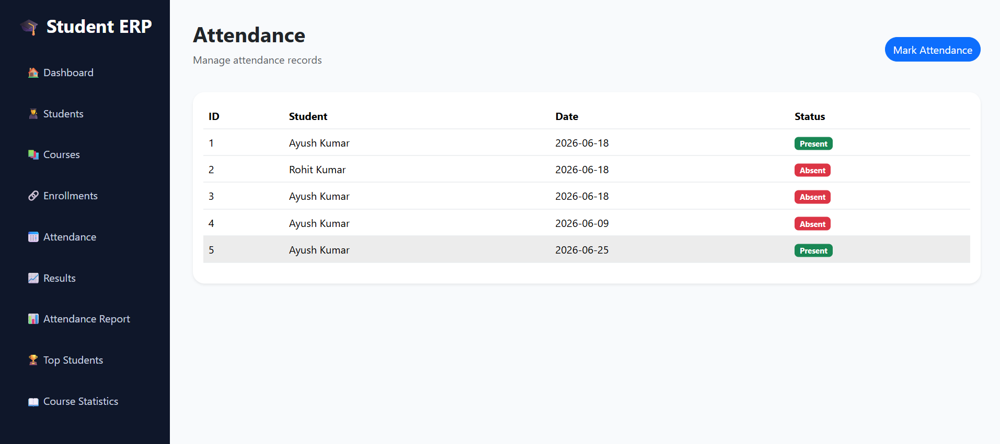
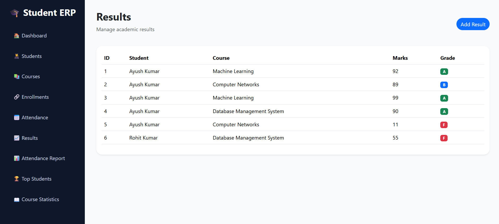
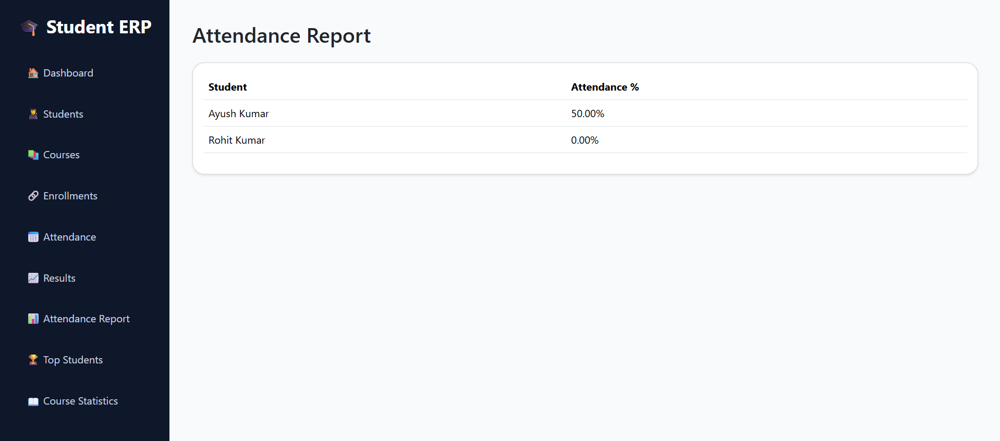

# Student ERP & Academic Management System


A full-stack academic management web application for handling students, courses, enrollments, attendance, results, reports, and dashboard analytics from one place.

## Features

- Dashboard with total students, courses, enrollments, attendance records, results, top performer, and Chart.js analytics.
- Student management with add, search, edit, and delete actions.
- Course management with course name and credit tracking.
- Enrollment management for assigning students to courses.
- Attendance management with date-wise Present/Absent records.
- Result management with marks validation and automatic grade calculation.
- Reports for attendance percentage, top students, and course enrollment statistics.

## Tech Stack

- Backend: Node.js, Express.js
- Frontend: EJS, HTML, CSS, Bootstrap 5, Font Awesome
- Database: PostgreSQL
- Visualization: Chart.js
- Environment management: dotenv

## Project Structure

```text
StudentErp/
|-- app.js
|-- config/
|   `-- db.js
|-- controllers/
|   |-- attendanceController.js
|   |-- courseController.js
|   |-- dashboardController.js
|   |-- enrollmentController.js
|   |-- reportController.js
|   |-- resultController.js
|   `-- studentController.js
|-- public/
|   `-- css/
|       `-- style.css
|-- routes/
|   |-- attendance.js
|   |-- courses.js
|   |-- dashboard.js
|   |-- enrollments.js
|   |-- reports.js
|   |-- results.js
|   `-- students.js
|-- screenshots/
|-- views/
|-- package.json
`-- README.md
```

## Getting Started

### Prerequisites

- Node.js and npm
- PostgreSQL

### Installation

Clone the repository:

```bash
git clone https://github.com/Ayusharyan-001/Student-ERP-System.git
cd Student-ERP-System
```

Install dependencies:

```bash
npm install
```

Create a `.env` file in the project root:

```env
DB_USER=your_postgres_username
DB_HOST=localhost
DB_NAME=student_erp
DB_PASSWORD=your_postgres_password
DB_PORT=5432
```

Create the PostgreSQL database:

```sql
CREATE DATABASE student_erp;
```

Connect to the `student_erp` database, then create the required tables:

```sql
CREATE TABLE students (
    student_id SERIAL PRIMARY KEY,
    full_name VARCHAR(100) NOT NULL,
    email VARCHAR(120) UNIQUE NOT NULL,
    phone VARCHAR(20),
    department VARCHAR(100),
    semester INTEGER CHECK (semester > 0)
);

CREATE TABLE courses (
    course_id SERIAL PRIMARY KEY,
    course_name VARCHAR(100) NOT NULL,
    credits INTEGER NOT NULL CHECK (credits > 0)
);

CREATE TABLE enrollments (
    enrollment_id SERIAL PRIMARY KEY,
    student_id INTEGER NOT NULL REFERENCES students(student_id) ON DELETE CASCADE,
    course_id INTEGER NOT NULL REFERENCES courses(course_id) ON DELETE CASCADE,
    UNIQUE (student_id, course_id)
);

CREATE TABLE attendance (
    attendance_id SERIAL PRIMARY KEY,
    student_id INTEGER NOT NULL REFERENCES students(student_id) ON DELETE CASCADE,
    attendance_date DATE NOT NULL,
    status VARCHAR(10) NOT NULL CHECK (status IN ('Present', 'Absent'))
);

CREATE TABLE results (
    result_id SERIAL PRIMARY KEY,
    student_id INTEGER NOT NULL REFERENCES students(student_id) ON DELETE CASCADE,
    course_id INTEGER NOT NULL REFERENCES courses(course_id) ON DELETE CASCADE,
    marks INTEGER NOT NULL CHECK (marks BETWEEN 0 AND 100),
    grade VARCHAR(2) NOT NULL
);
```

Start the development server:

```bash
npm run dev
```

Open the app in your browser:

```text
http://localhost:8080
```

For a normal Node.js start without nodemon:

```bash
npm start
```

## NPM Scripts

| Script | Description |
| --- | --- |
| `npm start` | Runs the app with `node app.js`. |
| `npm run dev` | Runs the app with `nodemon app.js`. |

## App Routes

| Route | Description |
| --- | --- |
| `/` | Dashboard overview and analytics. |
| `/students` | List and search students. |
| `/students/add` | Add a new student. |
| `/students/edit/:id` | Edit a student. |
| `/courses` | List courses. |
| `/courses/add` | Add a course. |
| `/enrollments` | List enrollments. |
| `/enrollments/add` | Assign a student to a course. |
| `/attendance` | List attendance records. |
| `/attendance/add` | Add an attendance record. |
| `/results` | List student results. |
| `/results/add` | Add marks and generate a grade. |
| `/reports/attendance` | View attendance percentage report. |
| `/reports/top-students` | View students ranked by average marks. |
| `/reports/course-stats` | View course enrollment statistics. |

## Screenshots

### Dashboard



### Students



### Courses



### Enrollments



### Attendance



### Results



### Reports



## Database Concepts Used

- Primary keys and foreign keys
- One-to-many and many-to-many relationships
- PostgreSQL constraints
- Joins
- Aggregate functions
- `GROUP BY`
- `COUNT()`
- `AVG()`
- Data validation
- Referential integrity

## Future Improvements

- Authentication and authorization
- Role-based access control
- Faculty dashboard
- Student portal
- Export reports to PDF or Excel
- Email notifications
- REST API endpoints

## Author

Ayush Kumar

Computer Science Engineering Student

Passionate about:

Full Stack Development
Database Systems
Backend Engineering
Application Support
Oracle Technologies

⭐ If you found this project useful, consider giving it a star on GitHub.